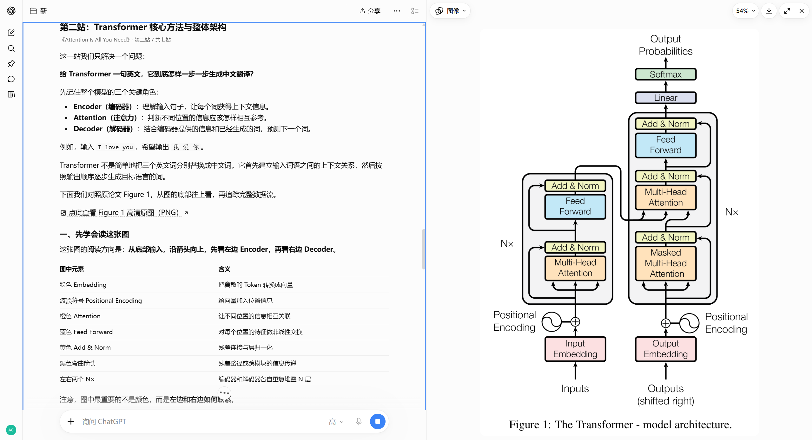

# 不烧心 academic-skills

**面向学生党的 ChatGPT 网页端科研插件合集：不耗 Codex 专用额度，用着不烧心。**

**简体中文** | [English](README.en.md)

## 项目初衷

作者自己也是学生，理解 token 和 API 调用成本会给经费有限的学生带来负担。传统科研 Skills 通常需要在 Codex、Claude Code 等客户端中使用；如果把日常读论文、找研究 Idea 等繁琐工作都放在那里，专用额度和费用可能让学生难以长期承担。

这些插件由我创作。我搜集了网上许多开源科研 Skill，借鉴各自的优点，并结合自己的理解进行设计与创作，整理成面向 **ChatGPT 网页端**使用的科研插件。学生可以通过网页版 ChatGPT 的 **Plugin Creator** 创建属于自己的插件，然后直接在 ChatGPT 对话中使用，**不消耗 Codex 或 Claude 专用额度，也无需额外配置 API Token**。

这里的“免 token”指无需额外配置或支付 API Token，也不消耗 Codex / Claude 专用额度；插件直接在 ChatGPT 网页端的对话中使用。

## 本项目的插件

这些插件安装并使用于 ChatGPT 网页端。插件内部由 Skill 规范和配套资源驱动；每个项目的 README 都提供了使用 Plugin Creator 创建个人插件的教程。

> **使用方式：在 ChatGPT 网页端创建并安装个人插件 → 在 ChatGPT 对话中选择插件并使用。**

## ChatGPT 网页端科研插件

本项目目前收录两个可在 ChatGPT 网页端创建并使用的科研插件：

### 🧩 ChatGPT 网页端插件 01 · [论文带读 · paper-reading](skills/paper-reading/README.md)

**不止带你读懂论文，也帮助你练习科研思维。** 在 ChatGPT 对话中边读讲解、边对照论文原图；通过质疑假设、检查证据和设计反证实验，逐步练习独立科研判断。



在 ChatGPT 网页端安装：查看[论文带读插件介绍与安装教程](skills/paper-reading/README.md#在-chatgpt-网页端创建和安装)。核心行为规范位于 [`paper-reading/SKILL.md`](skills/paper-reading/SKILL.md)。

### 🔬 ChatGPT 网页端插件 02 · [科研创新点发现与验证 · Research Idea Discovery](skills/research-idea-discovery/README.md)

**边读关键论文，边从真实失败、成功机制、结论冲突和应用困难中发现研究问题。** 再经过动机准入、近邻查新、复现资产核验和最小实验，判断是否值得继续。

在 ChatGPT 网页端安装：查看[Research Idea Discovery 插件介绍与安装教程](skills/research-idea-discovery/README.md#在-chatgpt-网页端创建和安装插件)。主 Skill：[`Research Idea Discovery`](skills/research-idea-discovery/skills/research-idea-discovery/SKILL.md)。

## 🙏 致谢与灵感来源

- **paper-reading** 的设计受到 [kelip-paper-reading](https://github.com/skJack/kelip-paper-reading) 和 [Research Starter Kit](https://github.com/LAMDA-NeSy/Research-Starter-Kit) 启发，感谢相关项目分享论文阅读与科研入门工作流参考。
- **Research Idea Discovery** 的设计受到 [ResearchStudio](https://github.com/microsoft/ResearchStudio)、[CCFA-Skills](https://github.com/mikubaka88/CCFA-Skills)、[ARIS](https://github.com/wanshuiyin/Auto-claude-code-research-in-sleep)、[RW Research Skill](https://github.com/ozrwayne/rw-research-skill)、[TaShan Research Skills](https://github.com/TashanGKD/tashan-research-skills)、[AI Night-Scientist](https://github.com/microsoft/ai_night_scientist) 和 [PatSnap Skills](https://github.com/patsnap/skills) 启发。

以上致谢表示设计与工作流灵感，不代表官方合作、背书或源码整合；实际复用的代码、文档和模板仍须遵守各自许可证。详细说明见各项目 README。

## 仓库结构

```text
academic-skills/
├── skills/
│   ├── paper-reading/
│   │   ├── README.md       # 论文带读的详细介绍与安装指南
│   │   ├── README.en.md    # English documentation
│   │   ├── SKILL.md        # 助手行为规范
│   │   └── scripts/        # 可选 PDF 图像辅助脚本
│   └── research-idea-discovery/
│       ├── README.md       # 项目介绍与 ChatGPT 使用指南
│       ├── README.en.md    # English project guide
│       ├── skills/         # 主 Skill、辅助角色与参考规范
│       └── scripts/        # 可选本地研究工作流工具
├── docs/images/            # 项目演示截图
├── tests/
├── .github/workflows/
├── README.md               # 科研技能集总览（中文默认）
├── README.en.md            # Collection overview in English
└── LICENSE
```

## 开发与许可

运行仓库总览与 paper-reading 检查：

```bash
python -m pip install -r requirements.txt pytest
python -m pytest -q
```

运行 Research Idea Discovery 自带的测试：

```bash
cd skills/research-idea-discovery
python -m unittest discover -s tests -v
```

本仓库采用 MIT License，详见 [`LICENSE`](LICENSE)。
