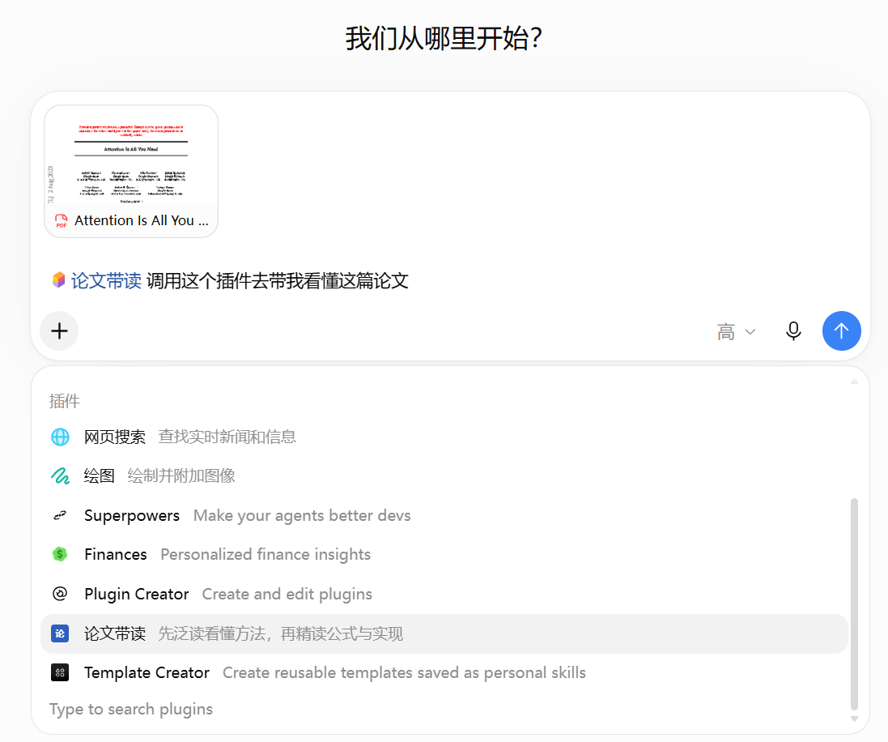
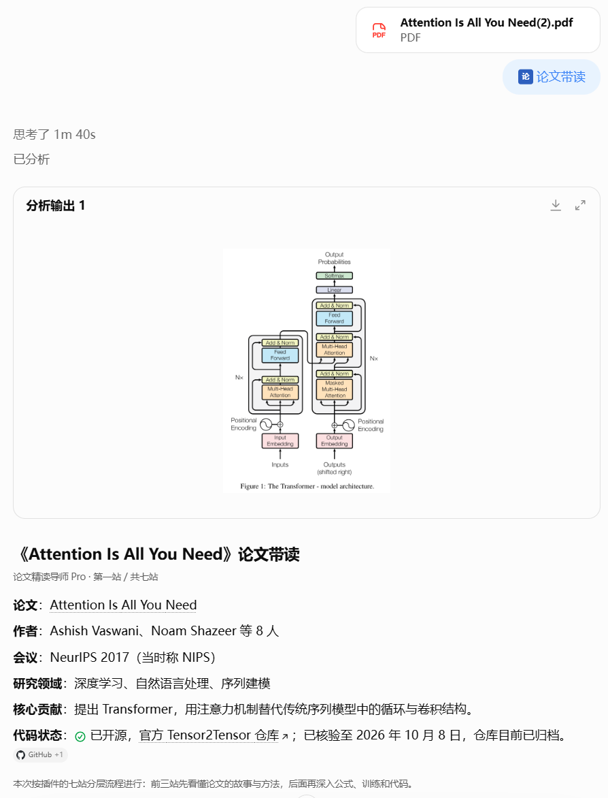
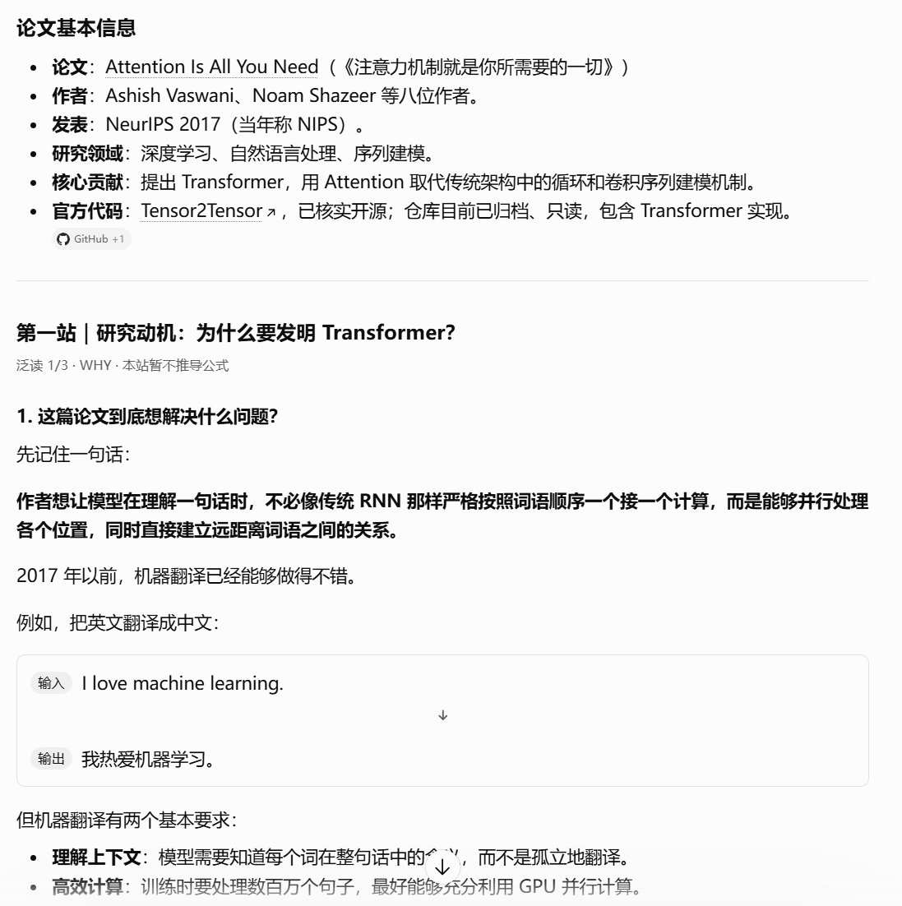
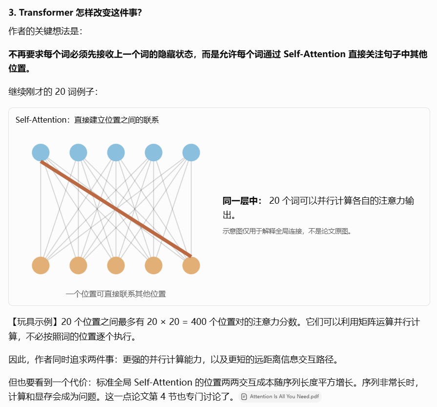
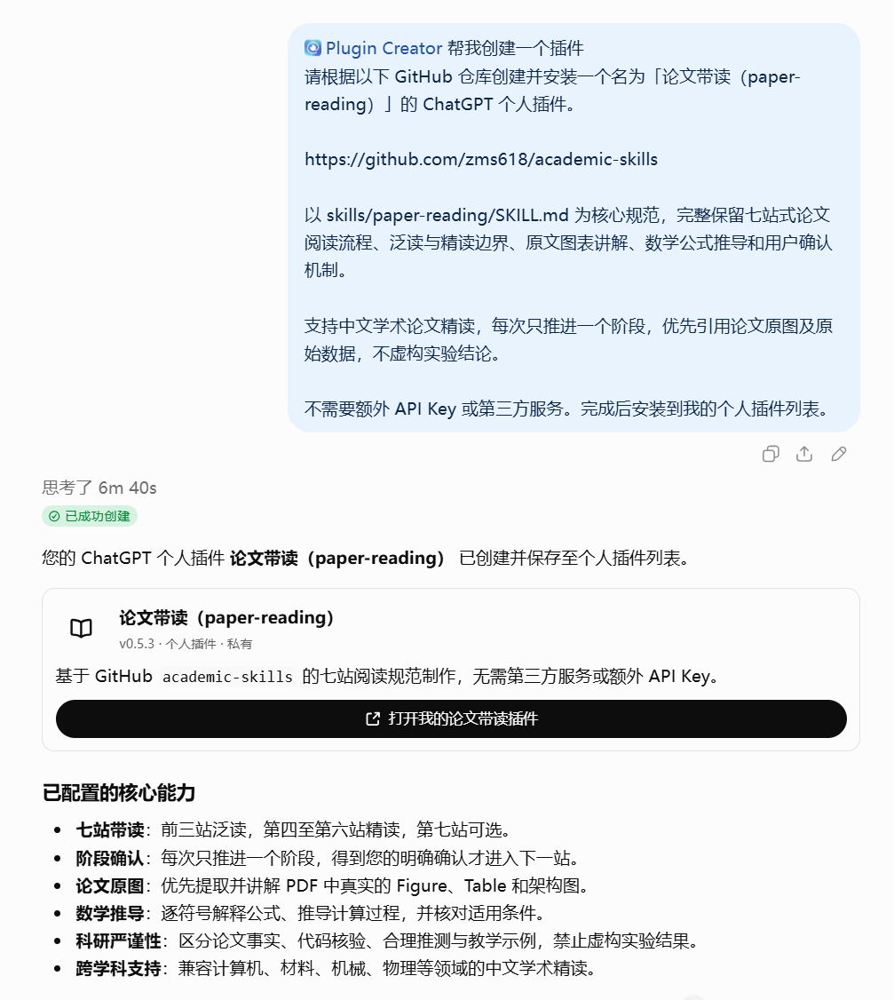

# paper-reading · A Guided Paper-Reading Skill

[简体中文](README.md) | **English** | [Collection overview](../../README.en.md)

`paper-reading` is a personal paper-reading plugin for ChatGPT Web, driven by its Skill instructions. It guides readers through a paper step by step, helping them understand the research rather than just receive a summary. The core workflow and assistant behavior are specified in [`SKILL.md`](SKILL.md).

> **This personal plugin is installed and used in ChatGPT Web; it does not consume Codex-specific task quota.** A step-by-step guide below shows how to create it with Plugin Creator and select it in a new conversation.

## Features

- **Use in ChatGPT conversations:** No Codex programming task is required. Paper reading remains subject to ChatGPT account, model, file-upload, and tool limits.
- **No separately configured API key or deployed model:** It uses capabilities available in the host; this does not mean model usage is unlimited.
- **Start with an overview, then go deeper:** Understand the motivation, architecture, and a worked example before deciding whether to continue into data protocols, mathematics, and implementation.
- **Read alongside original paper figures:** Explanations aim to use figures and captions. Side-by-side viewing depends on the ChatGPT client and its file and image tools.
- **The reader controls progress:** Advance one stage at a time. Stop after the first three overview stages or explicitly continue.

The goal is to help readers understand a paper's problem, method, and evidence. Distinguish what the paper reports, what has been checked in code, and what is inferred. Do not invent information absent from the sources.

## Seven-stage workflow

| Depth | Stage | Focus |
| --- | --- | --- |
| Overview | 1. Research question and motivation | Context, limitations of prior work, hypothesis, and paper metadata |
| Overview | 2. Core method and architecture | Inputs, modules, outputs, and design choices grounded in original figures |
| Overview; optional stopping point | 3. How the method works | Trace one example from input to output |
| Deep read | 4. Data and experimental protocol | Samples, preprocessing, label access, splits, and evaluation |
| Deep read | 5. Mathematical mechanism and training | Objectives, equations, supervision, and parameter updates |
| Deep read | 6. Exact execution and two-pass walkthrough | Execution order, state, caches, and clearly labeled toy examples |
| Optional | 7. Experiments, review, and research transfer | Results, ablations, negative evidence, fairness, reproducibility, and research directions |

Only one stage is covered at a time. Reply “continue” to confirm moving on; a real interaction control may also be used when the host provides one. The plugin does not skip stages automatically.

## Read alongside original paper figures

The main experience pairs a staged explanation with an original paper figure. The screenshot below shows this in ChatGPT. The demonstration image was supplied by the user; this repository does not distribute the paper PDF or its figures.


Other examples show selecting the plugin, uploading a PDF, generating an analysis card, and starting stage one. The Self-Attention diagram is an explanatory schematic, **not an original paper figure**.









## Create and install it on ChatGPT Web

`paper-reading` is not listed in ChatGPT's public plugin directory. You can create and install it as a personal plugin with **Plugin Creator**. The prompt below has been tested successfully to create the plugin in ChatGPT Web and save it to the personal plugin list:

1. Open [ChatGPT](https://chatgpt.com/) and select or mention **Plugin Creator** in a new conversation.
2. Send the complete prompt below (the verified prompt is in Chinese):

   ```text
   请根据以下 GitHub 仓库创建并安装一个名为「论文带读（paper-reading）」的 ChatGPT 个人插件。

   https://github.com/zms618/academic-skills

   以 skills/paper-reading/SKILL.md 为核心规范，完整保留七站式论文阅读流程、泛读与精读边界、原文图表讲解、数学公式推导和用户确认机制。

   支持中文学术论文精读，每次只推进一个阶段，优先引用论文原图及原始数据，不虚构实验结论。

   不需要额外 API Key 或第三方服务。完成后安装到我的个人插件列表。
   ```

3. Follow the interface to finish creation and installation. The “论文带读（paper-reading）” card should appear in your personal plugin list.

   

4. Start a new conversation, select “论文带读” in the plugin picker, and upload a paper PDF. You can start at stage one or explicitly request another stage.

If Plugin Creator cannot read the public repository, download and upload [`SKILL.md`](https://raw.githubusercontent.com/zms618/academic-skills/main/skills/paper-reading/SKILL.md). Creation access depends on account plan, region, and workspace permissions. A personal plugin is not thereby added to the public directory. See [Plugins in ChatGPT](https://help.openai.com/en/articles/20001256-plugins).

### Example opening prompt

> Help me read this paper. Start at stage one: explain the research problem and motivation in accessible language, and verify whether official code is available. Follow the seven-stage framework, covering only one stage at a time. Complete the first three overview stages, prioritize the original paper figures, and then pause to ask whether I want to continue to stage four.

ChatGPT use remains subject to account, model, file-upload, and tool limits; the plugin does not bypass them. See [ChatGPT model and usage limits](https://help.openai.com/en/articles/20001354-gpt-6-and-other-models-in-chatgpt).

### Workspace administrator installation

Some workspaces let administrators upload supported plugin ZIPs through **Admin Console → Plugins → Add** or import a marketplace from GitHub. This requires the appropriate permissions and a compatible package. A regular GitHub source ZIP may not be directly uploadable. This repository has not verified a regular clone or source ZIP as a one-click installation method. See [OpenAI's official documentation](https://help.openai.com/en/articles/20001256-plugins-in-chatgpt).

## Optional PDF image utilities

Local Python is not required for the main reading workflow. The repository includes two optional tools:

- `scripts/crop_pdf_asset.py` renders a user-selected PDF page or crops a region using relative coordinates.
- `scripts/make_figure_card.py` adds a title and short guide to a verified figure and checks that the original image pixels remain unchanged.

The scripts do not automatically detect figures, interpret them, or insert images into a chat. Python 3.10 or newer is required:

```bash
python -m venv .venv
```

Windows PowerShell:

```powershell
.\.venv\Scripts\Activate.ps1
python -m pip install -r requirements.txt
```

macOS / Linux:

```bash
source .venv/bin/activate
python -m pip install -r requirements.txt
```

Run these commands from the repository root. The PDF tools depend on PyMuPDF and Pillow. Figure cards need a system font that supports CJK characters; specify one with `--font` if needed. This repository does not distribute fonts.

Page numbers start at 1. Inspect the full page and caption first, then crop with `left top right bottom` coordinates in the 0–1 range:

```bash
python skills/paper-reading/scripts/crop_pdf_asset.py paper.pdf --page 3 --output output/page-3.png
python skills/paper-reading/scripts/crop_pdf_asset.py paper.pdf --page 3 --rect 0.49 0.12 0.95 0.49 --dpi 220 --output output/figure-3.png
python skills/paper-reading/scripts/make_figure_card.py output/figure-3.png --output output/figure-3-card.png --title "Figure 3 · Overall method" --intro "Trace the modules from input to output along the arrows."
```

## Scope and privacy

- This is not a standalone paper-reading application. It does not include an OCR service, paper QA model, automatic figure locator, or chat client.
- PDF interpretation, web research, image display, and cross-turn context depend on ChatGPT or another host and its tools.
- Python scripts process only user-selected PDF pages and regions; they do not verify scientific conclusions.
- Do not commit papers without redistribution rights, datasets, keys, tokens, private chats, or personal files.
- A `sandbox:` link may appear as a download. Inline preview and zoom are controlled by the host client.

## 🙏 Acknowledgements & Inspirations

The design of paper-reading was inspired by [kelip-paper-reading](https://github.com/skJack/kelip-paper-reading). We thank its author for sharing the project. This acknowledges design inspiration only; it does not imply official collaboration, endorsement, or source-code integration. Any code, documentation, or templates actually reused remain subject to the applicable license.

The current version is **v0.5.3**; see the repository's [`CHANGELOG.md`](../../CHANGELOG.md). The repository uses the MIT License; see [`LICENSE`](../../LICENSE).
